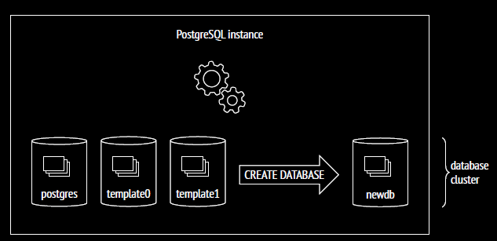

# Postgres Internals: Data Organization
## you either have an organized datasource or absolute chaos... sometimes both

# Introduction
PostgreSQL is an open-source relational database management system (RDBMS). So it is quite evident that data organization is a crucial aspect of it. PostgreSQL does the data organization in a very structured manner and at different levels of abstraction.
Since, discussing all the aspects of data organization in a single article would be overwhelming, and also because my last articles have gotten quite lengthy, I've decided to split this topic into multiple smaller articles. 
This article will focus on high level aspects one of the abstraction of data organization in PostgreSQL, namely the `database`.

Alongside, we will use a docker container to run PostgreSQL to showcase some demos and interact with it using the `psql` command-line tool. The docker 
container can be initialized with the following compose file. Please note that in the compose file, we are mounting a host volume to the container. This is used later to check/showcase some of the data organization aspects.

```yaml
services:
  data-org:
    image: 'postgres:17'
    environment:
      POSTGRES_USER: postgres
      POSTGRES_PASSWORD: password
      POSTGRES_DB: postgres
    ports:
      - "5432:5432"
    container_name: 'data-org'
    volumes:
      - ./data:/var/lib/postgresql/data:rw
```

# Database
It comes at a no surprise that at the top of data organization abstraction comes the database itself. 

In essence, PostgreSQL is a program that manages data. When this program is running, we call it a PostgreSQL **server**, or **instance**. Any data managed by PostgreSQL is stored in a **database**. 
A single PostgreSQL server can manage multiple databases. Together, the server and the databases it manages are called a **database cluster**.

When initializing a PostgreSQL cluster, it generally stores all the related files in a single directory. This directory is called the _data directory_ or `PGDATA`.

> For official [PostgreSQL docker container](https://hub.docker.com/_/postgres), the default `PGDATA` directory is `/var/lib/postgresql/data`. This can be changed by setting the `PGDATA` environment variable.
> This is the reason we mounted a host volume to the container in the compose file. So that we can inspect the data directory from the host OS.

After cluster initialization, `PGDATA` contains three identical databases which we can see using this query:
```sql
select datname as Database_Name from pg_database;
```
| database\_name |
| :--- |
| postgres |
| template1 |
| template0 |

More databases can be created using the `CREATE DATABASE` command. We can also drop databases using the `DROP DATABASE` command.

```sql
testdb_1=# create database newdb;
CREATE DATABASE
       
testdb_1=# drop database newdb;
DROP DATABASE
```



## The `postgres` Database
The `postgres` database is a default database that is created when a new database cluster is initialized. It is a default database for the `postgres` user.
This is a general purpose database that is used for any purposes. The official PostgreSQL docker container uses this database as the default database.

# The template Databases
Two databases, `template1` and `template0`, are standard system databases that exist in every newly created database cluster. These are called template databases because they are used as templates for creating new databases.

## The `template1` Database
`template1` is a database which is used as a template for creating new databases. Which means, running a simple `CREATE DATABASE` command will simply copy everything from the database `template1`.  We can modify this template database in any 
way: add a table, insert some data, create new extensions, or install procedural languages. Any of these actions would be propagated to subsequently created databases.

To verify this, we will do the following:
1. Connect to `pgsql` shell
2. Connect to the `template1` database
3. Create a table in the `template1` database called `t`
4. Insert a row into the table `t`
5. Create a new database `testdb`
6. Connect to the `testdb` database
7. Check if the table `t` exists in the `testdb` database and if it has the row we inserted in the `template1` database.

```sql
postgres=# \c template1
You are now connected to database "template1" as user "postgres".

template1=# create table t(data text);
CREATE TABLE

template1=# insert into t values ('test data');
INSERT 0 1

template1=# create database testdb;
CREATE DATABASE

template1=# \c testdb;
You are now connected to database "testdb" as user "postgres".

testdb=# select * from t;
   data
-----------
 test data
(1 row)
```
We've successfully verified that the table `t` exists in the `testdb` database and has the row we inserted in the `template1` database. We've seen how we can modify the `template1` database to create the blueprint for new databases.

This, however, is not advisable. Since you have the right to drop, modify, or add any objects in the `template1` database, it is possible to commit a mistake along the way and risk breaking the `CREATE DATABASE` command altogether.
For this reason, it would be better to leave template1 alone and create a template database of your own.

## Custom Template Databases
We can configure any database to be a template database. Let's change our newly created database `testdb` to be a template database and do the same verification.

```sql
testdb=# alter database testdb with is_template TRUE;
ALTER DATABASE

testdb=# create table t1 (data integer);
CREATE TABLE
                        
testdb=# insert into t1 values (42069); --nice
INSERT 0 1

testdb=# create database testdb_1 template testdb;
CREATE DATABASE

testdb=# \c testdb_1
You are now connected to database "testdb_1" as user "postgres".

testdb_1=# select * from t1;
 data
-------
 42069
(1 row)
```

We've successfully created a new database `testdb_1` using the `testdb` database as a template. And thus, we've seen how we can create a custom template database and use it to create new databases.
This way, you can now have customized templates without the need to worry about polluting `template1`. You can also safely drop the entire custom template database without the risk of breaking `CREATE DATABASE`.
If you wish, you can also create multiple template databases for various use cases.

Two major limitations exist `template1` and custom template databases:
1. To properly create a database from a custom template database, there should be no other connections present. `CREATE DATABASE` immediately fails if any connections exist at the start of the query.
2. We can't edit the locale or encoding of a database copied from `template1` or other custom database templates. So that means the following query will fail:
    ```sql
    testdb_1=# create database testdb_2 template testdb encoding 'SQL_ASCII';
    ERROR:  new encoding (SQL_ASCII) is incompatible with the encoding of the template database (UTF8)
    HINT:  Use the same encoding as in the template database, or use template0 as template.
    ```
   Fortunately, postgres already provides a solution for this. We can use the `template0` database as a template to create a database with a different encoding.

## The `template0` Database
PostgreSQL by default, creates a second template database called `template0`. This database is a "clean" template database and looks almost identical to the unmodified version of `template1`.
We could think of this template database as a fallback if anything irreversible happens to `template1`. It can also be used as a template for creating new databases, just like `template1`.

```sql
testdb_1=# create database testdb_0 template template0;
CREATE DATABASE
```
Unlike `template1` or custom database templates, we can use `template0` to create a database with a different encoding.

```sql
testdb_1=# create database testdb_2 template template0 encoding 'SQL_ASCII';
CREATE DATABASE
```

Postgres intentionally tries to discourage users from modifying `template0`. This can be seen from the fact that `template0` does not allow any connections due to the risk of accidental modifications. 
This can be verified from `pg_database` table and also from trying to connect to the `template0` database.

```sql
testdb_1=# select datname as database_name, datallowconn as connection_allowed from pg_database where datname like 'template%';
database_name | connection_allowed
---------------+--------------------
 template1     | t
 template0     | f
(2 rows)
              
testdb_1=# \c template0;
connection to server at "localhost" (127.0.0.1), port 5432 failed: FATAL:  database "template0" is not currently accepting connections
Previous connection kept
```

For these reasons, `template0` is considered a "safe" template database. So, if anything goes wrong with `template1`, It can be dropped and recreated with `template0` as the template database.

# Conclusion
In this article, we've discussed the high-level aspects of data organization in PostgreSQL, focusing on the `database` abstraction. 
We've seen what postgres databases are. We've also seen how we can create custom template databases and use them to create new databases. 
We've also seen the importance of `template0` as a fallback template database.