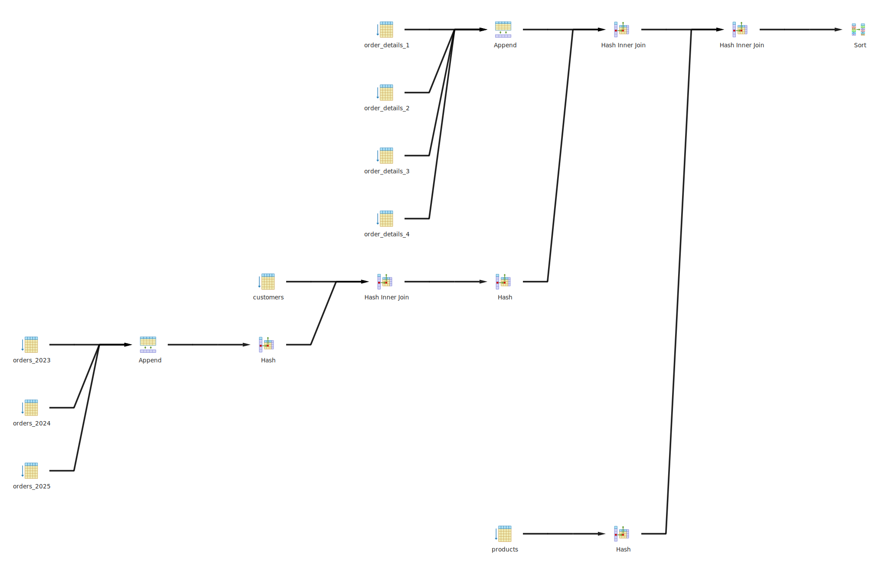
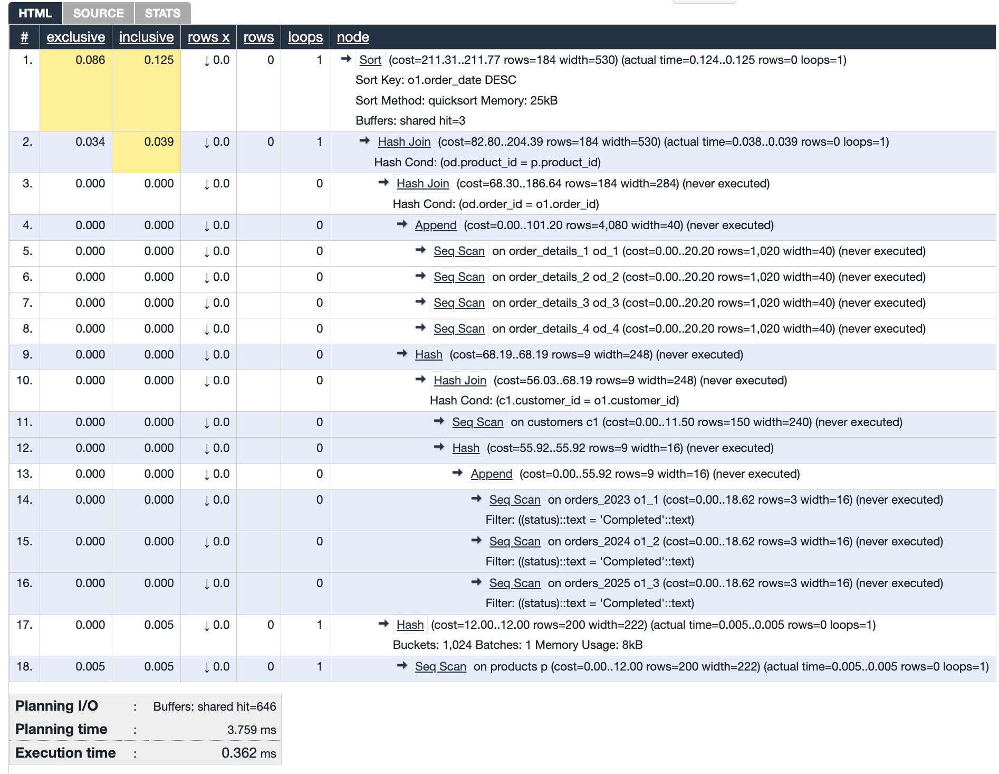
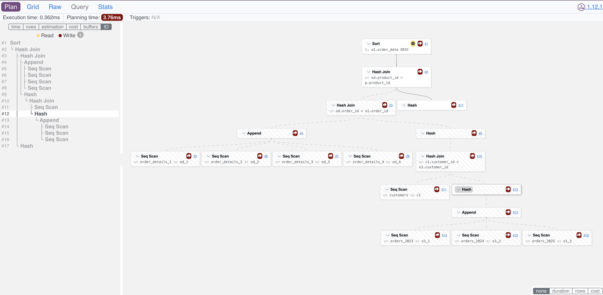

# Explain a.k.a. the Query plan

The `EXPLAIN` command is used to obtain information about how the query planner works. 

## Demo

### Explain
Start the database with [this docker compose](compose.yaml).
This will populate a `process` table.

let's try to query the table:

```sql
Explain SELECT * FROM process WHERE user_id='10cfd02f-21d3-4439-9983-5685ec9204c4';
```

The output will be something like:

```
Gather  (cost=1000.00..53116.77 rows=1 width=133)
  Workers Planned: 2
  ->  Parallel Seq Scan on process  (cost=0.00..52116.67 rows=1 width=133)
        Filter: (user_id = '10cfd02f-21d3-4439-9983-5685ec9204c4'::text)
```

### Explain Enhancement
Additional information can be derived by setting `track_io_timing` flag on. Enables timing of database I/O calls. This parameter is off by default, 
as it will repeatedly query the operating system for the current time, which may cause significant overhead on some platforms.
```sql
SET track_io_timing = on;
```
we can get even more information by using the options. The most important options are,
* ANALYZE: Adding this option makes EXPLAIN not just display the query plan and PostgreSQL's estimates, but also actually run the query. It then shows the real execution time and the number of rows processed at each step. Be cautious with this for UPDATE and DELETE queries since they’ll actually modify data! This is a must-have for serious SQL performance debugging.
* BUFFERS: This one works only with ANALYZE and provides details about how many pages are read, written, or dirtied at each step. If you’re analyzing performance, this is gold—you’ll definitely want this information.
* VERBOSE: When enabled, it shows all the output expressions for every step in the execution plan. Most of the time, this just adds noise, but can be useful for hard to debug queries.
* SETTINGS: Available since PostgreSQL v12, this option includes any performance-related parameters that have been changed from their defaults in the output. It's handy for understanding how tweaks to the configuration affect your query.
* WAL: Introduced in v13, this option shows the Write-Ahead Logging (WAL) activity generated by queries that modify data. Like BUFFERS, it works only with ANALYZE and is super useful for understanding the impact of data changes.

FORMAT: This lets you choose the format of the output. For humans, the default TEXT format is by far the easiest to read and work with for performance tuning. Other formats like XML, JSON, or YAML are better suited for automated tools or scripts.
```sql
Explain (analyze, buffers) SELECT * FROM process WHERE user_id='10cfd02f-21d3-4439-9983-5685ec9204c4';
```

The output of this will be,
```
Gather  (cost=1000.00..53116.77 rows=1 width=133) (actual time=446.306..449.906 rows=1 loops=1)
  Workers Planned: 2
  Workers Launched: 2
  Buffers: shared hit=1179 read=40521
  I/O Timings: shared read=731.428
  ->  Parallel Seq Scan on process  (cost=0.00..52116.67 rows=1 width=133) (actual time=433.582..433.598 rows=0 loops=3)
        Filter: (user_id = '10cfd02f-21d3-4439-9983-5685ec9204c4'::text)
        Rows Removed by Filter: 666666
        Buffers: shared hit=1179 read=40521
        I/O Timings: shared read=731.428
Planning:
  Buffers: shared hit=8
Planning Time: 3.036 ms
Execution Time: 449.998 ms
```

### Explanation
Let's go through the output of the enhanced `Explain` command line by line:
* `Gather  (cost=1000.00..53116.77 rows=1 width=133) (actual time=446.306..449.906 rows=1 loops=1)`
  * `Gather` -> This is the topmost node in the plan tree. It is used to collect the results from all the workers.
  * `(cost=1000.00..53116.77 rows=1 width=133)` -> This is the estimated cost of the plan. The cost is calculated by the planner based on the number of rows and the width of the rows.
    * `cost=1000.00..53116.77` -> The estimated cost of the plan. The cost is unitless and is used to compare the cost of different plans. The lower the cost, the better the plan.
    * `rows=1` -> The estimated number of rows that will be returned by the plan.
    * `width=133` -> The estimated width of the rows that will be returned by the plan.
  * `(actual time=446.306..449.906 rows=1 loops=1)` -> This is the actual time taken by the plan to execute.
  * `Workers Planned: 2` -> This is the number of workers that are planned to execute the plan.
  * `Workers Launched: 2` -> This is the number of workers that are actually launched to execute the plan. this can be different than the number of workers planned if the system is busy or have a restrictive configuration.
  * `Buffers: shared hit=1179 read=40521` -> This is the number of buffers that are used by the plan. The number of buffers that are hit in the shared buffer cache and the number of buffers that are read from the disk.
    * `shared hit=1179` -> The number of buffers that are hit in the shared buffer cache. This means that the data is already in the shared buffer cache and does not need to be read from the disk.
    * `read=40521` -> The number of buffers that are read from the disk. This means that the data is not in the shared buffer cache and needs to be read from the disk. This is an expensive operation compared to reading from the shared buffer cache.
  * `I/O Timings: shared read=731.428` -> This is the time taken to read the data from the disk. This is an important metric to consider when optimizing the query.
  * `->  Parallel Seq Scan on process  (cost=0.00..52116.67 rows=1 width=133) (actual time=433.582..433.598 rows=0 loops=3)` -> In postgres the query plans execute from bottom to top. This is the bottommost node in the plan tree. This is the actual operation that is performed by the plan.
    * `Parallel Seq Scan` -> This is the actual operation that is performed by the plan. In this case, it is a parallel sequential scan of the table.
    * `loops=3` -> The number of times the operation is executed.
    * `Filter: (user_id = '10cfd02f-21d3-4439-9983-5685ec9204c4'::text)` -> perform filter on the rows that are returned by the scan.
    * `Rows Removed by Filter: 666666` -> The number of rows that are removed by the filter. This is a per-loop average, rounded to the nearest integer. 
      * The total number of rows removed is this value multiplied by the number of loops. so in this case, it is 3*666666=1999998.
      * So that means the total number of rows should be returned from the query is 2000000-1999998=2. But only 1 row is returned. where is the other row?
      * This is because this value is a per-loop average, rounded to the nearest integer.
      * What does this mean? When more than one loop is used for the plan node (e.g. loops=2 or greater), then “Rows Removed by Filter” is an average value of the “Rows Removed by Filter” per-loop.
      * For example, if one loop removed 10 rows, and another removed 30 rows, we’d expect to see a value of 20 as the average of the two. 
      * When there’s one loop (loops=1), the figure is the actual number of rows processed and removed.
  * `Buffers: shared hit=8` -> The number of buffers that are used by the plan. The number of buffers that are hit in the shared buffer cache.
  * `Planning Time: 3.036 ms` -> The time taken by the planner to generate the plan. The planner generates the plan by considering different strategies from statistics.
    * For simple queries, the planning time is usually very low. But for complex queries involving multiple tables and joins, the planning time can be significant.
  * `Execution Time: 449.998 ms` -> The total time taken by the plan to execute. This is the sum of the actual time taken by the plan to execute. Generally this is what we try to optimize.

Whew, that was a lot of information specially for a simple select planning. But this information is very useful when optimizing queries. By looking at the output of the `Explain` command, we can identify the bottlenecks in the query and optimize it accordingly.

For more complex queries the output will be more complex and will have more information. But the basic structure of the output will be the same.
Example for a more complex query with partitioned table, multiple join, subqueries and CTEs:

Query:
```sql
with Completed_orders AS
        (select o1.order_id, o1.order_date, o1.customer_id, o1.status from orders o1)
SELECT
    c.first_name,
    c.last_name,
    o.order_id,
    o.order_date,
    p.product_name,
    od.quantity,
    od.price,
    od.discount,
    (od.price * od.quantity) - (od.price * od.quantity * od.discount) AS final_price
FROM
    (select c1.first_name, c1.last_name, c1.customer_id from customers c1) c
        JOIN
    (select o2.order_id, o2.order_date, o2.customer_id, o2.status from Completed_orders o2 where o2.status='Completed') o ON c.customer_id = o.customer_id
        JOIN
    order_details od ON o.order_id = od.order_id
        JOIN
    products p ON od.product_id = p.product_id
ORDER BY
    o.order_date DESC;
```

Plan:
```
Sort  (cost=211.31..211.77 rows=184 width=530) (actual time=0.124..0.125 rows=0 loops=1)
  Sort Key: o1.order_date DESC
  Sort Method: quicksort  Memory: 25kB
  Buffers: shared hit=3
  ->  Hash Join  (cost=82.80..204.39 rows=184 width=530) (actual time=0.038..0.039 rows=0 loops=1)
        Hash Cond: (od.product_id = p.product_id)
        ->  Hash Join  (cost=68.30..186.64 rows=184 width=284) (never executed)
              Hash Cond: (od.order_id = o1.order_id)
              ->  Append  (cost=0.00..101.20 rows=4080 width=40) (never executed)
                    ->  Seq Scan on order_details_1 od_1  (cost=0.00..20.20 rows=1020 width=40) (never executed)
                    ->  Seq Scan on order_details_2 od_2  (cost=0.00..20.20 rows=1020 width=40) (never executed)
                    ->  Seq Scan on order_details_3 od_3  (cost=0.00..20.20 rows=1020 width=40) (never executed)
                    ->  Seq Scan on order_details_4 od_4  (cost=0.00..20.20 rows=1020 width=40) (never executed)
              ->  Hash  (cost=68.19..68.19 rows=9 width=248) (never executed)
                    ->  Hash Join  (cost=56.03..68.19 rows=9 width=248) (never executed)
                          Hash Cond: (c1.customer_id = o1.customer_id)
                          ->  Seq Scan on customers c1  (cost=0.00..11.50 rows=150 width=240) (never executed)
                          ->  Hash  (cost=55.92..55.92 rows=9 width=16) (never executed)
                                ->  Append  (cost=0.00..55.92 rows=9 width=16) (never executed)
                                      ->  Seq Scan on orders_2023 o1_1  (cost=0.00..18.62 rows=3 width=16) (never executed)
                                            Filter: ((status)::text = 'Completed'::text)
                                      ->  Seq Scan on orders_2024 o1_2  (cost=0.00..18.62 rows=3 width=16) (never executed)
                                            Filter: ((status)::text = 'Completed'::text)
                                      ->  Seq Scan on orders_2025 o1_3  (cost=0.00..18.62 rows=3 width=16) (never executed)
                                            Filter: ((status)::text = 'Completed'::text)
        ->  Hash  (cost=12.00..12.00 rows=200 width=222) (actual time=0.005..0.005 rows=0 loops=1)
              Buckets: 1024  Batches: 1  Memory Usage: 8kB
              ->  Seq Scan on products p  (cost=0.00..12.00 rows=200 width=222) (actual time=0.005..0.005 rows=0 loops=1)
Settings: search_path = 'public'
Planning:
  Buffers: shared hit=646
Planning Time: 3.759 ms
Execution Time: 0.362 ms
```

We will explore these unexplained planning methods (such as `Hash Join`, `Append`, `Seq Scan`, `Sort`, etc.) in the upcoming sections.

## Visualization Tools
There are many tools available to visualize the query plan with explain analyze. Some of the popular ones are:
* **PGAdmin**: PGAdmin has a pretty good graphical query plan visualization tool. You can see the query plan in a graphical format by clicking on the `Explain` button in the query editor.

* [Depesz' EXPLAIN ANALYZE visualizer](https://explain.depesz.com/)
  
* [Dalibo's EXPLAIN ANALYZE visualizer](https://explain.dalibo.com/). Offline version available at https://github.com/dalibo/pev2.
  

## Summary
In this section, we learned about the `Explain` command in PostgreSQL. We saw how to use the `Explain` command to get information about the query plan. We also saw how to enhance the `Explain` command to get more information about the query plan. We went through the output of the `Explain` command and understood the different parts of the output. We also saw some of the visualization tools available to visualize the query plan.

## Essential Reads
* [PostgreSQL Documentation: EXPLAIN](https://www.postgresql.org/docs/current/sql-explain.html)
* [Explaining the unexplainable](https://www.depesz.com/2013/04/16/explaining-the-unexplainable/): If you can read only one article about `Explain`, this is the one to read.
* [How to interpret PostgreSQL EXPLAIN ANALYZE output](https://www.cybertec-postgresql.com/en/how-to-interpret-postgresql-explain-analyze-output/): A good article on visualizing the query plan.