# How to optimize a select query with Btree Index
## PostgreSQL: To B-tree or not to B-tree!

## Introduction

### What is a database index?
A database index is a data structure used to improve the speed and efficiency of data retrieval operations in a database table. It functions like an index in a book, helping the database quickly locate specific rows based on query conditions, without having to scan the entire table.

Every table in a relational database has a primary index, which is created automatically when the table is created. In addition to the primary index, you can create one or more secondary indexes on specific columns to speed up queries that filter, sort, or group by those columns.

In postgres, there are several types of indexes available, each with its own advantages and disadvantages. The choice of index type depends on the specific use case and query patterns of the database. The available index types in postgres include Btree, Hash, GiST, SP-GiST, GIN, and BRIN. 

### Btree Index
Btree is the default index method in postgres. The Btree index is one of the most commonly used index types in postgres due to its efficiency and versatility. 
Btree index unsurprisingly uses a Btree data structure to store the indexed values. This data structure allows for efficient searches, insertions, and deletions in logarithmic time. The Btree index is well-suited for range queries, equality queries, and sorting operations.

## Btree Data Structure
A B-tree is a self-balanced tree data structure that is a generalized form of the Binary Search Tree (BST). However, unlike a binary tree, each node can have more than two children. The B-tree is designed to work well with disk storage systems and is commonly used in databases and file systems.

According to Knuth's definition, a B-tree of order m is a tree which satisfies the following properties:
1. Every node has at most m children.
2. Every node, except for the root and the leaves, has at least ⌈m/2⌉ children.
3. The root node has at least two children unless it is a leaf.
4. All leaves appear on the same level.
5. A non-leaf node with k children contains k−1 keys.

There is a variant of Btree called B+tree. In a B+tree, the keys are stored only in the leaf nodes, while the internal nodes contain only pointers to the child nodes. This allows for faster range queries and sequential access.

### Btree Index in Postgres

In postgres, the default btree index is actually a B+tree, This allows for faster range queries and sequential access. Each leaf node contains a pointer to the next leaf node, which allows for efficient range scans. Each leaf node points to the corresponding page in the table where the actual data is stored.

A page is a fixed-size block of data that is read from or written to disk as a single unit. The size of a page is typically 8KB in postgres. Each page consists of a header, items, pointers to other pages and free space. The amount of free space in a page, among other things depends on the `fillfactor`(check references for details) of the table.

### Example B+-Tree Structure
Consider a B+-Tree with a degree of 3:

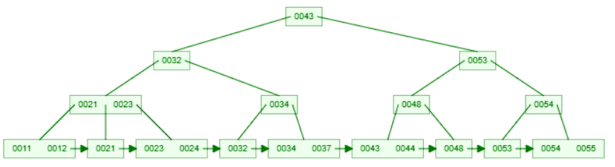

### Searching

The algorithm for searching in a B+tree is similar to that of a binary search tree. To search for a key in a B+tree, you start at the root node and compare the key with the keys in the node. If the key is less than the first key in the node, you move to the left child node. If the key is greater than or equal to the first key in the node, you move to the right child node. You continue this process until you reach a leaf node, where you search for the key sequentially.

For example, consider searching for the key `44` (k=44) in the above b+tree.

1. Start at the root node and compare the key with the first key in the node.

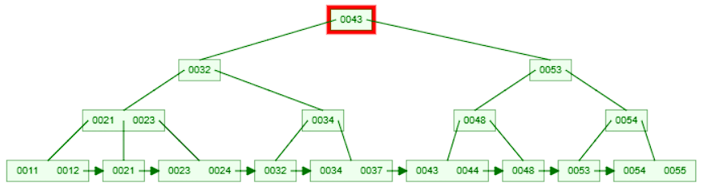

2. Since `44` is greater than `43`, move to the right child node and compare the key with the first key in the node.

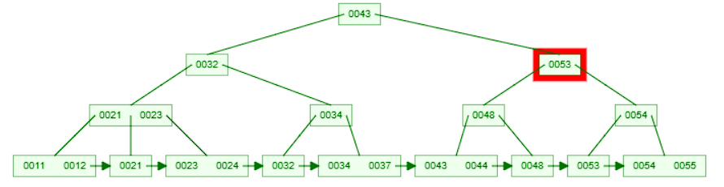

3. Since `44` is less than `53`, move to the left child node and compare the key with the first key in the node.

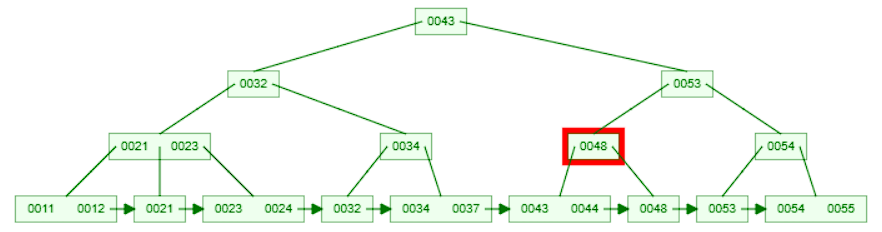

4. Since `44` is less than `48`, move to the left child node. Now we are at a leaf node. 

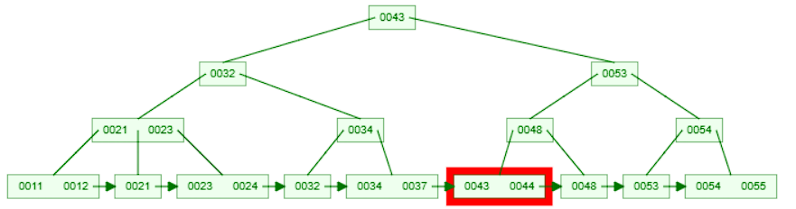

5. Search for the key `44` in the leaf node sequentially (since they are sorted). If the key is found, return the corresponding value. 

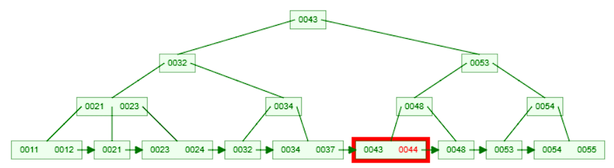

### Insertion

The algorithm for inserting in a b+tree is as follows:
* Start at the root node and compare the key with the keys in the node.
* If the key is less than the first key in the node, move to the left child node.
* If the key is greater than or equal to the first key in the node, move to the right child node.
* Continue this process until you reach a leaf node.
* Insert the key into the leaf node in sorted order.
* If the leaf node overflows, split the node into two and promote the middle key to the parent node.
* If the parent node overflows, split the node and promote the middle key to the parent node.
* Continue this process until you reach the root node.
* If the root node overflows, split the node and create a new root node.
* Update the pointers accordingly.

For example, consider inserting the key `25` into the above b+tree.

1. Start at the root node and compare the key with the keys in the node.

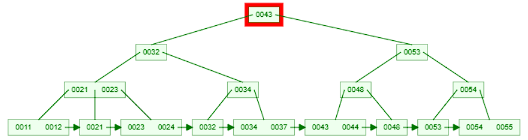

2. Since `25` is less than `43`, move to the left child node and compare the key with the keys in the node.

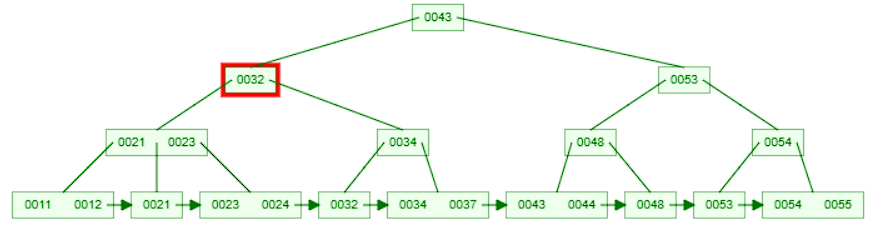

3. Since `25` is less than `32`, move to the left child node and compare the key with the keys in the node.

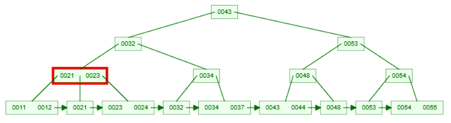

4. This node has multiple keys [21, 23]. We compare 25 sequencially with the keys and find that it is greater than the right most key `23`. So we move to the right child node. Now we are at a leaf node.

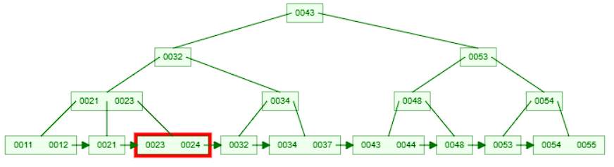

5. This leaf node already has 2 values [23,24]. We insert the key `25` into the leaf node in sorted order.

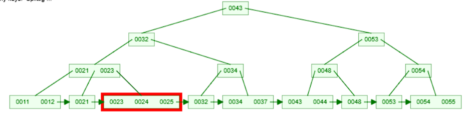

6. The leaf node now has too many keys. We split the node into two and promote the middle key `24` to the parent node.

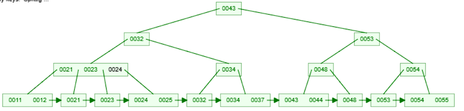

7. The parent node now has too many keys. We split the node into two and promote the middle key `23` to the parent node.

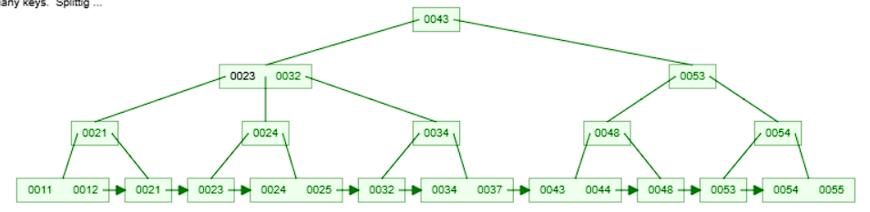

8. The parent node now has 2 keys which is within the limit. The insertion is complete.

### Deletion

The algorithm for deleting in a b+tree is similar to that of insertion. The key difference is that when deleting a key from a node, if the node becomes underflowed, we borrow a key from a sibling node or merge the node with a sibling node.

For example, consider deleting the key `32` from the above b+tree.

1. Start at the root node and compare the key with the keys in the node.

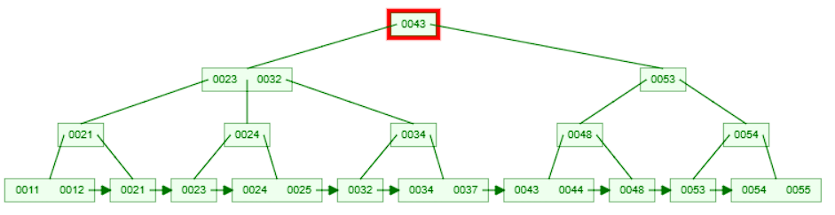

2. Since `32` is less than `43`, move to the left child node and compare the key with the keys in the node.

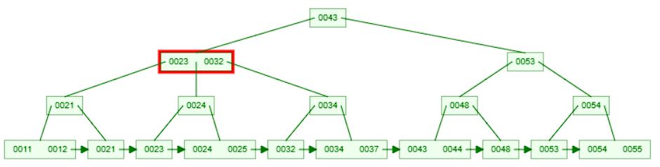

3. This node is interesting. It has 2 values [23, 32]. It already has the key `32` but since it is not a leaf node, we can't delete it directly. We need to search for `32` in the leaf node and delete it from there. So, we move to the right child node since `32` is greater than or equal to `32` which is the right key in the node.

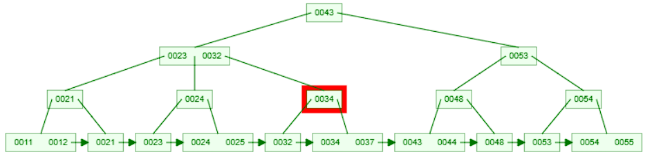

4. Since we are still not at a leaf node, we compare the key with the keys in the node. We find that `32` is less than `34` so we move to the left child node. Now we are at a leaf node.

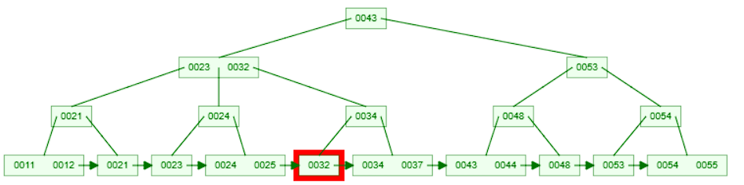

5. This leaf node only has the key `32`. We delete the key from the leaf node.

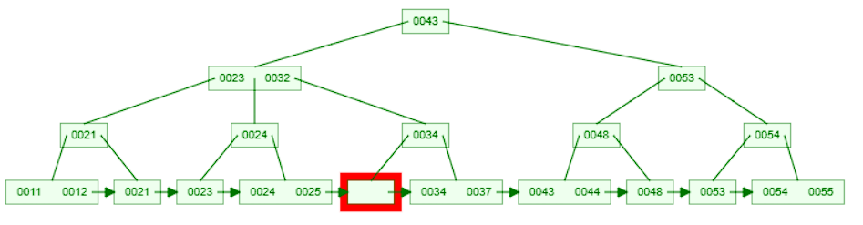

6. The leaf node now has too few keys. We borrow a key `34` from the sibling node to the right. We update the parent node accordingly.

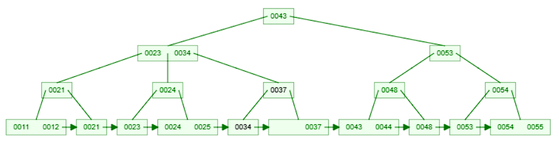

7. The parent node and these 2 leaf nodes are now balanced. The deletion is complete.

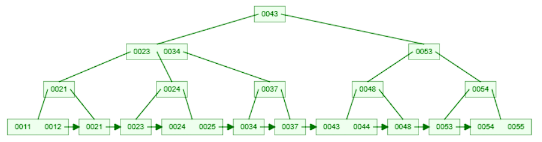

## B+tree Index implementation in Postgres

Diving into PostgreSQL's B-Tree index implementation can be a bit overwhelming, but focusing on the key concepts can make it more digestible. Here's a breakdown of the most crucial points:

1. **Lehman and Yao's High-Concurrency B-Tree Algorithm**: PostgreSQL's B-Tree is based on Lehman and Yao's algorithm, which introduces:
   * _Right-Link Pointers_: Each page (node) has a pointer to its right sibling, facilitating efficient navigation during searches and modifications.
   * _High Keys_: Each page maintains an upper bound key, known as the high key, indicating the maximum key value that page can hold.

2. **Page Structure and Navigation**
   * _Pivot Tuples_: In internal (non-leaf) pages, pivot tuples act as separators with downlinks to child pages. They guide the search process by defining key ranges for each subtree. 
   * _Unique Keys_: To ensure all keys are unique, PostgreSQL appends the heap tuple ID (TID) as a tiebreaker. This uniqueness is crucial for maintaining the correct order and structure of the B-Tree.
3. **Insertion and Deletion**
   * _Insertion_: When inserting a new key, PostgreSQL places it in the appropriate leaf page. If the page overflows, it splits, and the middle key moves up to the parent as a new pivot tuple.
   * _Deletion_: PostgreSQL uses a simplified version of the deletion logic described by Lanin and Shasha. When a key is deleted, the system ensures the tree remains balanced and the structural invariants are maintained.
4. **Simplified Deletion with Lanin and Shasha algorithm**: The Lanin and Shasha algorithm simplifies deletion in B-Trees by making the process more predictable and less disruptive to the structure of the tree. Here's a simple breakdown of how it works:
   * _Avoid Immediate Merging_:
     When a key is deleted, instead of immediately trying to rebalance the tree (e.g., merging nodes or redistributing keys), the algorithm allows the tree to temporarily tolerate a less-than-optimal state.
   * _Delayed Rebalancing_: Rebalancing only happens when it becomes unavoidable, such as during subsequent deletions or tree operations.
5. **Concurrency Control**: While Lehman and Yao's original algorithm doesn't require read locks, PostgreSQL employs page-level read locks because its in-memory buffers are shared among backends. This approach ensures that no record is modified while it's being read, maintaining data consistency.
6. **Scanning and Traversal**:
   * _Forward Scans_: Utilize the right-sibling pointers to navigate through the leaf pages efficiently. 
   * _Backward Scans_: Supported by additional left-sibling pointers, allowing reverse traversal of the index.
7. **Suffix Truncation**: To optimize storage, PostgreSQL implements suffix truncation in pivot tuples. This means that only the necessary parts of the key are stored in internal nodes, reducing space usage while preserving the ability to navigate the tree correctly.

## How to create a Btree Index in Postgres

To create a Btree index in postgres, you can use the `CREATE INDEX` command with the `USING BTREE` clause. But, since btree is the default index method in postgres, the `USING BTREE` clause is optional. Here's an example of creating a Btree index on a column in a table:

```sql
CREATE INDEX index_name ON table_name(column_name);
```

## When to use a Btree Index

Btree indexes are well-suited for a wide range of query patterns, including:
- `Operators`:  the PostgreSQL query planner will consider using a B-tree index whenever an indexed column is involved in a comparison using one of these operators: `<   <=   =   >=   >`
- `Range queries`: Btree indexes are efficient for queries that filter rows based on range conditions.
- `Sorting`: Btree indexes are efficient for queries that require sorting the results based on the indexed column.
- `Grouping`: Btree indexes are efficient for queries that group the results based on the indexed column.
- `Unique constraints`: Btree indexes can be used to enforce unique constraints on a column.
- `Partial indexes`: Btree indexes can be used to create partial indexes that index only a subset of the rows in a table.
- `Multicolumn indexes`: Btree indexes can be used to create multicolumn indexes that index multiple columns together.
- `Index-only scans`: Btree indexes can be used to perform index-only scans, where all the required data is available in the index itself.
- `Covering indexes`: Btree indexes can be used as covering indexes to avoid fetching data from the table.


## When NOT to use a Btree Index

While Btree indexes are versatile and efficient for many use cases, there are scenarios where other index types might be more suitable. Here are some cases where you might not want to use a Btree index:
- `Full-text search`: Btree indexes are not well-suited for full-text search queries. Consider using a GIN or GIST index for full-text search.
- `Spatial data`: Btree indexes are not well-suited for spatial data queries. Consider using a GIST or SP-GIST index for spatial data.
- `JSON data types`: Btree indexes are not well-suited for queries involving JSON data types. Consider using a GIN or GiST index for JSON data types.
- `Array data types`: Btree indexes are not well-suited for queries involving array data types. Consider using a GIN or GiST index for array data types.
- `Pattern matching`: Btree indexes are not well-suited for queries involving pattern matching using LIKE or ILIKE operators. Consider using a trigram index for pattern matching.
- `Naturally ordered high cardinality data`: Btree indexes are not well-suited for columns with high cardinality (many distinct values). Consider using a BRIN index for columns with high cardinality.
- `Write performance`: Btree indexes can impact write performance, especially for tables with frequent insert, update, or delete operations. Consider the trade-offs between read and write performance when using Btree indexes.

## Conclusion

Btree indexes are a versatile and efficient index type in PostgreSQL that can improve the performance of queries involving range conditions, sorting, grouping, and unique constraints. 
In this article, we explored the theory behind Btree indexes, their implementation in PostgreSQL, and when to use or avoid them. In the next article, we'll delve into the practical aspects of creating, maintaining, and optimizing Btree indexes in PostgreSQL to optimize query performance.


### References
> `fillfactor`: The fillfactor for a table is a percentage between 10 and 100. 100 (complete packing) is the default. When you specify a smaller fillfactor, INSERT operations pack table pages only to the indicated percentage. The remaining space on each page is reserved for updating rows on that page. This gives UPDATE a chance to place the updated copy of a row on the same page as the original, which is more efficient than placing it on a different page. For a table whose entries are never updated, complete packing is the best choice. However, in heavily updated tables smaller fillfactors are appropriate. This parameter cannot be set for TOAST tables.

### Further Reading
- [PostgreSQL Documentation on Indexes](https://www.postgresql.org/docs/current/indexes.html)
- This excellent B+tree visualization tool: [B+tree Visualization](https://www.cs.usfca.edu/~galles/visualization/BPlusTree.html)
- [PostgreSQL btree index implementation](https://github.com/postgres/postgres/blob/master/src/backend/access/nbtree/README)
- [B+Tree](https://www.programiz.com/dsa/b-plus-tree)
- [Lanin-Shasha algorithm](https://www.amazon.de/-/en/Vladimir-Lanin/dp/1021187267)
- [Designing Data-Intensive Applications](https://learning.oreilly.com/library/view/designing-data-intensive-applications/9781491903063/ch03.html#sec_storage_b_trees)
