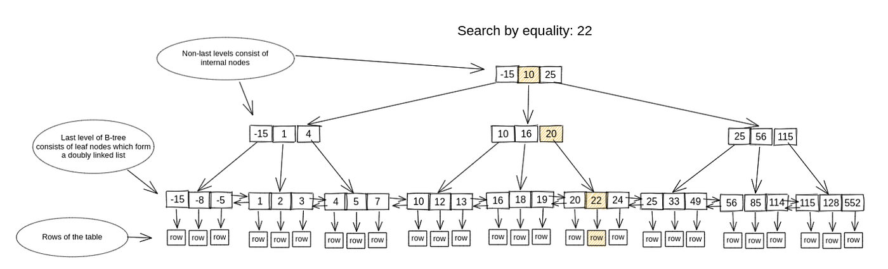

# How to optimize a select query with Btree Index
## PostgreSQL: To B-tree or not to B-tree!

## Introduction

### What is a database index?
A database index is a data structure used to improve the speed and efficiency of data retrieval operations in a database table. It functions like an index in a book, helping the database quickly locate specific rows based on query conditions, without having to scan the entire table.

Every table in a relational database has a primary index, which is created automatically when the table is created. In addition to the primary index, you can create one or more secondary indexes on specific columns to speed up queries that filter, sort, or group by those columns.

In postgres, there are several types of indexes available, each with its own advantages and disadvantages. The choice of index type depends on the specific use case and query patterns of the database. The available index types in postgres include Btree, Hash, GiST, SP-GiST, GIN, and BRIN. 

### Btree Index
Btree is the default index method in postgres. The Btree index is one of the most commonly used index types in postgres due to its efficiency and versatility. 
Btree index unsurprisingly uses a Btree data structure to store the indexed values. This data structure allows for efficient searches, insertions, and deletions in logarithmic time. The Btree index is well-suited for range queries, equality queries, and sorting operations.

## Btree Data Structure
A B-tree is a self-balanced tree data structure that is a generalized form of the Binary Search Tree (BST). However, unlike a binary tree, each node can have more than two children. The B-tree is designed to work well with disk storage systems and is commonly used in databases and file systems.

According to Knuth's definition, a B-tree of order m is a tree which satisfies the following properties:
1. Every node has at most m children.
2. Every node, except for the root and the leaves, has at least ⌈m/2⌉ children.
3. The root node has at least two children unless it is a leaf.
4. All leaves appear on the same level.
5. A non-leaf node with k children contains k−1 keys.

### Example B-Tree Structure
Consider a B-Tree with a maximum of 3 keys per node:

## How it works

A Btree is a tree data structure where each node contains a fixed number of keys and pointers to child nodes. The keys in each node are sorted, and the pointers point to child nodes that contain keys within a certain range. This allows for efficient searches, insertions, and deletions.

## Advantages

- Efficient searches: Btrees allow for efficient searches by traversing the tree in logarithmic time.
- Sorted data: Btrees store data in sorted order, which allows for efficient range queries.
- Balancing: Btrees are kept balanced by splitting and merging nodes as needed, which ensures that the tree remains efficient.

## Disadvantages

- Overhead: Btrees have some overhead in terms of memory and disk space due to the need to store pointers to child nodes.
- Slower insertions: Btrees can be slower to insert data compared to some index methods like hash indexes due to the need to rebalance the tree.

## Demo

We start the database with [this docker compose file](compose.yaml).
